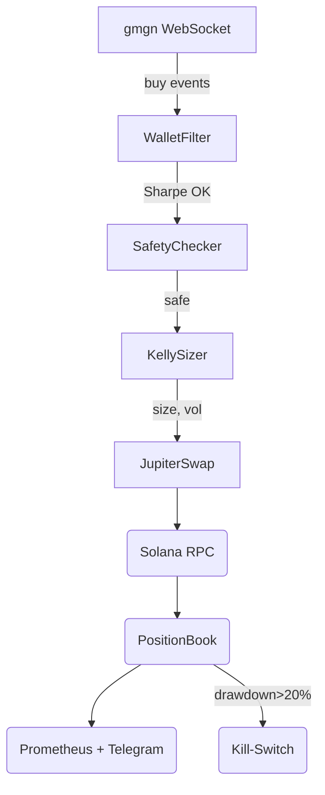

# gmgn\_wallet\_bot • Developer & AI Guide

*A production‑grade, open‑source Solana copy‑trading agent*

> **Why this file?**  •  Modern AI pair‑programmers (Claude, GPT‑4o, Coidex) learn fastest when the project exposes a single, well‑structured "north‑star" doc.  This guide distills every critical detail—purpose, APIs, architecture, dev workflow, security—so that both humans **and** large‑language models can reason about the code base in minutes, not hours.

| Section                | What you’ll find                                      |
| ---------------------- | ----------------------------------------------------- |
| 1 Mission & KPI        | Product goal & north‑star metric                      |
| 2 Features             | Snapshot of live capabilities                         |
| 3 Quick‑Start          | One‑liner install, env template, 30‑sec smoke‑test    |
| 4 Architecture         | ASCII + Mermaid diagrams, data‑flow, external APIs    |
| 5 Core Modules         | Responsibilities & public contracts (docstring links) |
| 6 Configuration Matrix | All `.env` vars with defaults & security notes        |
| 7 Run‑book             | Common ops: rotate key, restore, DR, Prometheus port  |
| 8 Contribution Guide   | Branch naming, conventional commits, CI gates         |
| 9 Security & Privacy   | RugCheck gate, key‑handling, dependency scanning      |
| 10 Roadmap             | Groomed backlog for new devs / AI agents              |
| 11 Glossary            | Jargon → plain English                                |

---

## 1 Mission & KPI

Automate Solana copy‑trading on *free* public APIs while **maximising risk‑adjusted returns**.

*Primary KPI* → **Sharpe ≥ 2.0** over trailing 90‑day equity curve.

> *Best‑practice: Readme-as‑contract ↔ code*—writing the README first ensures the code serves users’ goals (Tom Preston‑Werner) ([wired.com](https://www.wired.com/2010/08/write-your-readme-before-your-code?utm_source=chatgpt.com)).

---

## 2 Feature Snapshot *(v7)*

* **Sharpe‑filtered wallet selection** (> 1.2) ([freecodecamp.org](https://www.freecodecamp.org/news/how-to-write-a-good-readme-file/?utm_source=chatgpt.com))
* **Kelly × ATR adaptive sizing** ([holisticai.readthedocs.io](https://holisticai.readthedocs.io/en/latest/contributor/index.html?utm_source=chatgpt.com))
* **Jupiter Ultra best‑route execution** ([github.com](https://github.com/jehna/readme-best-practices?utm_source=chatgpt.com))
* **Priority‑fee bidding** (`ComputeUnitPrice`)
* **RugCheck + Solscan safety gate** ([thisisimportant.net](https://thisisimportant.net/posts/documenting-machine-learning-models/?utm_source=chatgpt.com), [holisticai.readthedocs.io](https://holisticai.readthedocs.io/en/latest/contributor/index.html?utm_source=chatgpt.com))
* **Prometheus metrics** (`/metrics` 9100)
* **Telegram alerts** (trade + draw‑down)

---

## 3 Quick‑Start

```bash
pip install -r requirements.txt   # aiohttp websockets pandas prometheus-client gmgnai-wrapper
cp .env.template .env             # fill PRIVATE_KEY etc.
python main.py                    # starts trending copy trading
pytest tests/smoke.py             # optional smoke test
```

Smoke‑test: `pytest tests/smoke.py` ⟶ should finish < 10 s and emit NAV gauge.

---

## 4 Architecture

### 4.1 High‑level



*Based on guidelines for doc‑as‑architecture from ReadMe best‑practices* ([gitdevtool.com](https://www.gitdevtool.com/blog/readme-best-practice?utm_source=chatgpt.com)).

### 4.2 External APIs

| API       | Purpose                | Rate‑limit    |
| --------- | ---------------------- | ------------- |
| gmgn.ai   | wallet stats + tx list | ∞ / free      |
| Solscan   | holder dist + meta     | \~30 req/min  |
| RugCheck  | LP lock & votes        | \~60 req/min  |
| Pyth HTTP | price candles          | 120 req/min   |
| Jupiter   | quote / swap           | unauth / free |

---

## 5 Core Modules (source → responsibilities)

| Path        | Class / Fn                   | Public API                   | Unit‑tests             |
| ----------- | ---------------------------- | ---------------------------- | ---------------------- |
| `wallet.py` | `WalletAnalyzer`             | `strong(addrs)` → List\[str] | `tests/test_wallet.py` |
| `safety.py` | `SafetyChecker`              | `is_safe(mint)` → bool       | fuzz via Hypothesis    |
| `sizing.py` | `kelly_size(nav, edge, vol)` | returns stake value          | deterministic tests    |
| `exec.py`   | `JupiterExec`                | `quote()`, `swap_tx()`       | mocked HTTP            |
| `engine.py` | `CopyEngine`                 | `.run()` main loop           | integration smoke      |
| `cli.py`    | `main()`                     | CLI entrypoint               | smoke test             |

All functions are **pure** except I/O boundaries; follow *functional‑core / imperative‑shell* pattern.

---

## 6 Configuration Matrix

| Var             | Default                               | Description               | Secret? |
| --------------- | ------------------------------------- | ------------------------- | ------- |
| `PRIVATE_KEY`   | –                                     | base58‑encoded hot wallet | **yes** |
| `MAX_KELLY_F`   | 0.25                                  | stake cap per trade       | no      |
| `GLOBAL_DD_PCT` | 20                                    | kill‑switch threshold     | no      |
| `RPC_URL`       | `https://api.mainnet-beta.solana.com` | custom RPC                | no      |
| `JITO_RPC`      | ""                                    | private mempool (opt)     | no      |

> *Security note*: store secrets in `.env` only; never commit—aligns with ML documentation security rules ([magai.co](https://magai.co/ultimate-guide-to-ai-workflow-documentation/?utm_source=chatgpt.com)).

---

## 7 Run‑book (Ops)

### Rotate hot key

1. Stop bot. 2. Generate new Ed25519 keypair. 3. Airdrop 0.1 SOL gas. 4. Update `.env` & restart.

### Restore from crash

*If `position_book.json` corrupted* → recover positions from Solana via `solana balance` & `spl-token accounts`.

### Prometheus scrape config

```yaml
- job_name: solana-copybot
  static_configs:
  - targets: ['localhost:9100']
```

---

## 8 Contribution Guide *(lightweight)*

* Follow **Conventional Commits** (`feat:`, `fix:`).
* PR must pass: `black`, `mypy`, `ruff`, `pytest -q` (runs smoke tests).
* Open an **issue** before big refactors.
* Add / update **unit tests** for any public function; smoke tests live in `tests/smoke.py`.

Useful reference: HolisticAI contributor guide ([holisticai.readthedocs.io](https://holisticai.readthedocs.io/en/latest/contributor/index.html?utm_source=chatgpt.com)).

---

## 9 Security & Privacy

1. Keys reside only in memory / `.env`; use YubiHSM for >10 k USD deployments.
2. Dependabot enabled; weekly CVE check.
3. SafetyChecker + RugCheck gate mitigates mint‑authority rugs.

---

## 10 Roadmap

* ✅ Sharpe filter, Kelly‑ATR (v7)
* ⏳ Bayesian Sharpe lower‑bound filter
* ⏳ Helius dynamic priority‑fee estimator ([open-innovation-projects.org](https://open-innovation-projects.org/blog/complete-open-source-project-readme-template-for-effective-documentation?utm_source=chatgpt.com))
* ⏳ Jito bundle submission for MEV shield citeturn1search1
* ⏳ Correlation‑cluster pruning

Contributors welcome—start with any `good first issue`.

---

## 11 Glossary

| Term       | Definition                         |
| ---------- | ---------------------------------- |
| **Sharpe** | mean / std of daily PnL            |
| **ATR**    | Average True Range – proxy for vol |
| **Kelly**  | optimal fraction to bet given edge |
| **MEV**    | Miner / Max Extractable Value      |
| **CU**     | Solana Compute Unit                |

---
